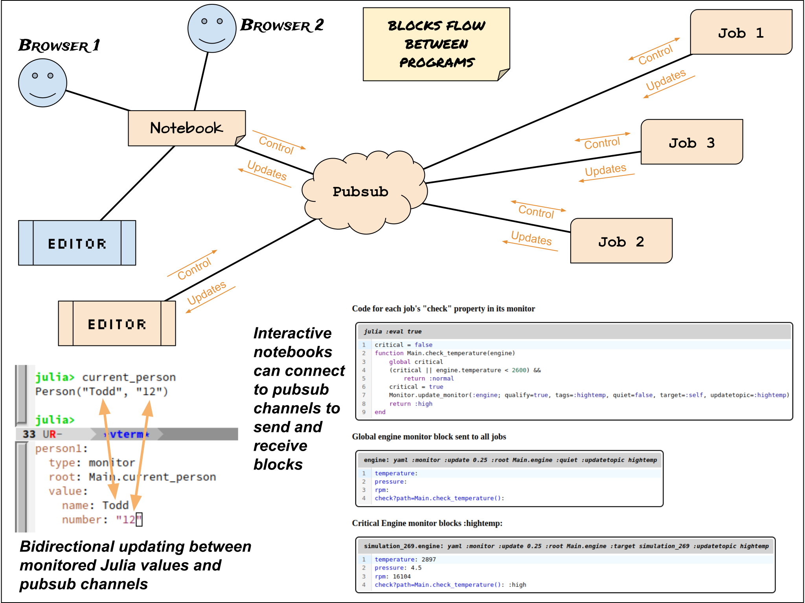

# Monitor.jl
Listen to and update monitors on Julia.

Monitor.jl is a pubsub system that communicates with "blocks" (JSON objects) which allow you to
monitor and change data values in subscribing Julia programs.




# Capabilities

Monitor.jl communicates with simple JSON structures called “blocks” to

* Dynamically monitor Juila data, automatically detect when it changes, and report the new values  
  * You use the connection to make and remove monitors in running programs  
  * Polls for value changes – optionally specify how often to check values  
  * Polling means you do **not** need to alter your code to inform the system when a value changes  
* Modify mutable values  
* Evaluate code  
* Exchange data between programs  
* Treat programs like ”database shards”  
* Optionally target a subset of subscribers  
* Communicate via  
  * Pubsub with REDIS streams  
  * Named pipes  
  * Easy to extent with custom transports

Monitor.jl can publish to different topics to

* Evaluate code and select data to monitor  
* Send updates to monitored values  
* Control programs for rollups or MapReduce

Connected UIs, like notebooks, can present data blocks in a meaningful way

* Blocks can update in-place  
* Eval blocks can be sent with a button click  
* Blocks can appear in sections based on tags  
* Views can create more monitors and change monitored values

Monitor.jl supports 4 types of blocks with some of these common properties:

* **`type:`** how a subscriber should interpret the block. Supported types are "monitor", "code", "data", and "delete".  
* **`name:`** This block’s name; receivers overwrite the previous values for duplicates  
* **`origin:`** ID of the subscriber that produced this block  
* **`topics:`** optional topic(s) to publish the block to – transports should route these  
* **`tags:`** identifies sets of blocks this block “belongs to”. Can be a string or an array of strings; monitor and data blocks can use this to categorize results and also for cleanup  
* **`targets:`** optional subscriber or list of subscribers that should receive the block (others ignore it)  

Block types:  

* Monitor blocks -- monitor Julia values  
  * **`type:`** "monitor"
  * **`topic:`** controls which program(s) install the monitor
  * **`targets:`** controls which program(s) install the monitor
  * **`updateTopics:`** controls which programs receive updates  
      A UI sending a monitor with this property should automatically subscribe to the topics.  
  * **`updateTargets:`** controls which programs receive updates  
  * **`tags:`** identifyies a set of blocks. Can be a string or an array of strings  
  * **`root:`** root value for the variables  
  * **`quiet:`** while true, monitor but don't publish updates  
  * **`value:`** variables that monitor values  
      Initial values are not placed into Julia but incoming changes are not placed into Julia data  

* Code blocks -- run Julia code  
  * **`type:`** "code"  
  * **`topic:`** optional topic to publish the block to, when it’s not the default  
  * **`targets:`** optional list of subscribers that should receive the block (others ignore it)  
  * **`tags:`** identifyies a set of blocks. Can be a string or an array of strings  
  * **`language:`** language in which to evaluate code  
  * **`return:`** true if the code should return a block to be published.  
  * **`value:`** code to evaluate  

* Data Blocks -- hold data, can be used for responses, 
  * **`type:`** "data"  
  * **`topic:`** optional topic to publish the block to, when it’s not the default  
  * **`targets:`** optional list of subscribers that should receive the block (others ignore it)  
  * **`tags:`** identifyies a set of blocks. Can be a string or an array of strings  
  * **`code:`** optional name of the code block that produced this block, if was one  
  * **`value:`** value of data  

* Delete Blocks
  * **`type:`** "delete"  
  * **`topic:`** optional topic to publish the block to, when it’s not the default  
  * **`targets:`** optional list of subscribers that should receive the block (others ignore it)  
  * **`value:`** NAME, [NAME, ...], {"tagged": TAG}, or {"tagged": [TAG, ...]}  

# API:

```julia
start(con::Connection; roots::Dict{Symbol,Any}=Dict(), verbosity=0)

send(data) -- queue an update to send out

shutdown() -- close the connection
```

ADDING YOUR OWN TRANSPORTS

You can make your own transport by implementing two required handlers:

```julia
# returns updates, an iterator of Symbol=>JSON3.Object, this is allowed to block
get_updates(con::Connection{T}, wait_time::Float64)

# send updates out, this is allowed to block
send_updates(con::Connection{T}, changes::Dict{Symbol})
```

Optional handlers:

```julia
# initialize a newly created connection
init(::Connection)

# returns the time to wait between refreshes
incoming_update_period(::Connection)

# returns the time to wait before sending out pending publishes
outgoing_update_period(::Connection)

# returns whether there are pending updates
has_updates(::Connection, ::UpdateType)

# Receive a monitor block, by default just calls base_handle_monitor(con, name, mon)
handle_monitor(con::Connection, name::Symbol, mon::JSON3.Object) =

# Receive an eval block, by default just calls base_handle_eval(con, name, ev)
handle_eval(con::Connection, name::Symbol, ev::JSON3.Object)

# Receive a data block, by default just calls base_handle_data(con, name, data)
handle_data(con::Connection, name::Symbol, data::JSON3.Object) =

# Delete data blocks, by default just calls base_handle_delete(con, data)
handle_delete(con::Connection, del::JSON3.Object) =
```
