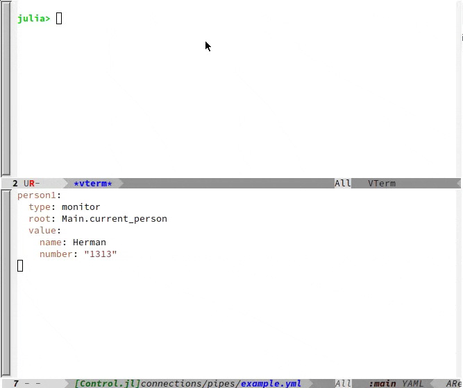

# Monitor.jl
Listen to and update monitors on Julia.

Monitor.jl is a pubsub system that communicates with "blocks" (JSON objects) which allow you to
monitor and change data values in subscribing Julia programs.



Monitor.jl supports 4 types of blocks with some of these common properties:

* **`name:`** This block’s name; receivers overwrite the previous values for duplicates  
* **`origin:`** ID of the subscriber that produced this block  
* **`topics:`** optional topic(s) to publish the block to – transports should route these  
* **`tags:`** identifies sets of blocks this block “belongs to”. Can be a string or an array of strings; monitor and data blocks can use this to categorize results and also for cleanup  
* **`targets:`** optional subscriber or list of subscribers that should receive the block (others ignore it)  
* **`type:`** how a subscriber should interpret the block. Supported types are "monitor", "code", "data", and "delete".  

Block types:  

* Monitor blocks -- monitor Julia values  
  * **`type:`** "monitor"
  * **`topic:`** controls which program(s) install the monitor
  * **`targets:`** controls which program(s) install the monitor
  * **`updateTopics:`** controls which programs receive updates  
      A UI sending a monitor with this property should automatically subscribe to the topics.  
  * **`updateTargets:`** controls which programs receive updates  
  * **`tags:`** identifyies a set of blocks. Can be a string or an array of strings  
  * **`root:`** root value for the variables  
  * **`value:`** variables that monitor values  
      Initial values are not placed into Julia but incoming changes are not placed into Julia data  

* Code blocks -- run Julia code  
  * **`type:`** "code"  
  * **`topic:`** optional topic to publish the block to, when it’s not the default  
  * **`targets:`** optional list of subscribers that should receive the block (others ignore it)  
  * **`tags:`** identifyies a set of blocks. Can be a string or an array of strings  
  * **`language:`** language in which to evaluate code  
  * **`return:`** true if the code should return a block to be published.  
  * **`value:`** code to evaluate  

* Data Blocks -- hold data, can be used for responses, 
  * **`type:`** "data"  
  * **`topic:`** optional topic to publish the block to, when it’s not the default  
  * **`targets:`** optional list of subscribers that should receive the block (others ignore it)  
  * **`tags:`** identifyies a set of blocks. Can be a string or an array of strings  
  * **`code:`** optional name of the code block that produced this block, if was one  
  * **`value:`** value of data  

* Delete Blocks
  * **`type:`** "delete"  
  * **`topic:`** optional topic to publish the block to, when it’s not the default  
  * **`targets:`** optional list of subscribers that should receive the block (others ignore it)  
  * **`value:`** NAME, [NAME, ...], {"tagged": TAG}, or {"tagged": [TAG, ...]}  

API:

```julia
start(con::Connection; roots::Dict{Symbol,Any}=Dict(), verbosity=0)

queue_update(name, data) -- queue an update to send out

shutdown() -- close the connection
```

ADDING YOUR OWN TRANSPORTS

You can make your own transport by implementing two required handlers:

```julia
get_updates(con::Connection{T}, wait_time::Float64)

send_updates(con::Connection{T}, changes::Dict{Symbol})
```

Optional handlers:

```julia
# initialize a newly created connection
init(::Connection)

# returns the time to wait between refreshes
incoming_update_period(::Connection)

# returns the time to wait before sending out pending publishes
outgoing_update_period(::Connection)

# returns whether there are pending updates
has_updates(::Connection, ::UpdateType)
```

